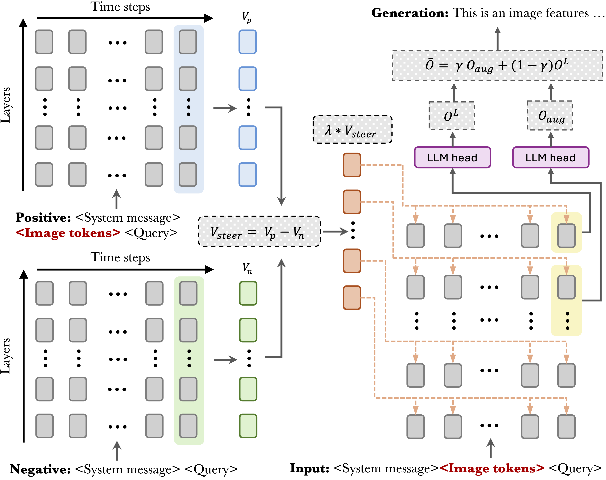

# VISTA: Visual Information Steering with Token-logit Augmentation

[](https://arxiv.org/abs/2402.xxxxx)

This is the official implementation of the paper "The Hidden Life of Tokens: Reducing Hallucination of Large Vision-Language Models via Visual Information Steering".



## Overview

VISTA is a training-free inference-time intervention framework that reduces hallucination in Large Vision-Language Models (LVLMs) while promoting genuine information. Our approach reveals and addresses three key patterns in how LVLMs process information:

1. **Gradual Visual Information Loss**: Visually grounded tokens gradually become less favored throughout generation
2. **Early Excitation**: Semantically meaningful tokens achieve peak activation in layers earlier than the final layer
3. **Hidden Genuine Information**: Visually grounded tokens maintain relatively high rankings at inference

VISTA combines two complementary approaches:
- **Visual Steering Vector (VSV)**: Reinforces visual information in activation space
- **Self-Logits Augmentation (SLA)**: Leverages early layer activations to promote semantically meaningful decoding

## Key Features

- Training-free inference-time intervention
- No external supervision required
- Compatible with various decoding strategies
- Applicable across multiple LVLM architectures
- Reduces hallucination by ~40% on evaluated open-ended tasks

## Installation

```bash
# Clone the repository
git clone https://github.com/LzVv123456/VISTA
cd VISTA

# Install dependencies
pip install -r requirements.txt
```

## Prepare Data
Download MSCOCO 2014 dataset from [the official website](https://cocodataset.org/#home) and extract it to your data directory.


## Usage

```bash
# For CHAIR evaluation.
bash run_chair.sh

# For POPE evaluation (specify split with --pope-type).
bash run_pope.sh

# For mmhal evaluation.
bash run_mmhal.sh
```

Please check the corresponding bash script for how to read results.

### Configuration Options

1. **Model Selection**: Use "--model" to specify the target LVLM (supported: "llava-1.5", "instructblip", "shikra", "minigpt-4")

2. **Visual Steering Vector (VSV )**: Enable with "--vsv" and control strength via "--vsv-lambda"

3. **Self-Logits Augmentation (SLA)**: Enable with "--logits-aug", configure target layers with "--logits-layers" and mixing ratio with "--logits-alpha"


## Best Practices

1. VSV is designed to counteract Gradual Visual Information Loss and is suitable for open-ended generation tasks. Different LVLMs favor different lambda scales, so users should calibrate the scale when using new architectures. The --vsv-lambda parameter provides a flexible way to adjust the model from being more aggressive (more hallucination) to more conservative.
3. The impact of SLA depends on both target layers and the strength of --logits-alpha. A rule of thumb is to use a smaller alpha for larger window sizes and vice versa (see Table 4 in the paper).


## Citation
```bibtex
@article{li2024hidden,
  title={The Hidden Life of Tokens: Reducing Hallucination of Large Vision-Language Models via Visual Information Steering},
  author={Li, Zhuowei and Shi, Haizhou and Gao, Yunhe and Liu, Di and Wang, Zhenting and Chen, Yuxiao and Liu, Ting and Zhao, Long and Wang, Hao and Metaxas, Dimitris N.},
  journal={arXiv preprint arXiv:2402.xxxxx},
  year={2024}
}
```

## Acknowledgement
This project builds upon excellent work from:
- [PAI](https://github.com/LALBJ/PAI)
- [ICV](https://github.com/shengliu66/ICV)
- [OPERA](https://github.com/shikiw/OPERA)

We'd like to extend our appreciation for these great works.
